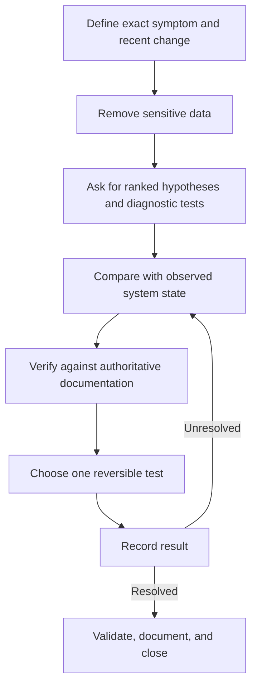

# Case Study: AI-Assisted Troubleshooting

A sanitized case study for using an AI assistant as a research aid during Windows troubleshooting while preserving human judgment, verification, and change-control discipline.

No real prompts, usernames, device names, customer data, logs, or proprietary environment details are included.

## Objective

Reduce research time on unfamiliar symptoms without treating generated suggestions as authoritative or applying unverified changes to a live system.

## Workflow

## Operating Rules

| Rule | Purpose |
| --- | --- |
| Remove sensitive data before prompting | Protect user and organization information |
| Ask for hypotheses, not a guaranteed fix | Preserve diagnostic thinking |
| Verify commands and settings independently | Catch plausible but incorrect output |
| Prefer read-only diagnostics first | Reduce unintended change |
| Test one reversible action at a time | Keep cause and effect observable |
| Record failed hypotheses | Improve future troubleshooting and escalation |

## Example Process

1. Capture the exact error, scope, recent changes, and troubleshooting already attempted.
2. Replace identifying values with labels such as `LAB-DEVICE` and `SAMPLE-USER`.
3. Request a ranked list of possible causes with a diagnostic check for each.
4. Reject suggestions that do not match the known system state.
5. Verify relevant commands, registry paths, and settings with authoritative documentation.
6. Run one read-only or reversible diagnostic step.
7. Record the command, result, interpretation, and next decision.
8. Repeat until the root cause is supported by evidence.
9. Validate the original symptom and document the resolution.

## Portfolio Artifacts

- [Diagnostic log template](docs/diagnostic-log-template.md)
- [Verification checklist](docs/verification-checklist.md)
- [Sanitized example diagnostic log](examples/sanitized-diagnostic-log.md)

## Evidence Limitations

The workflow was reconstructed from personal troubleshooting practice. It does not include customer records or claim that AI output independently resolved an incident. The demonstrated skill is controlled research, evidence gathering, and verification.

## Skills Demonstrated

Ticket intake, hypothesis-driven troubleshooting, data minimization, source verification, change control, documentation, and escalation readiness.

> AI output can be confidently wrong. Commands that alter registry, identity, permissions, storage, networking, or security controls require independent verification and an approved recovery path.

